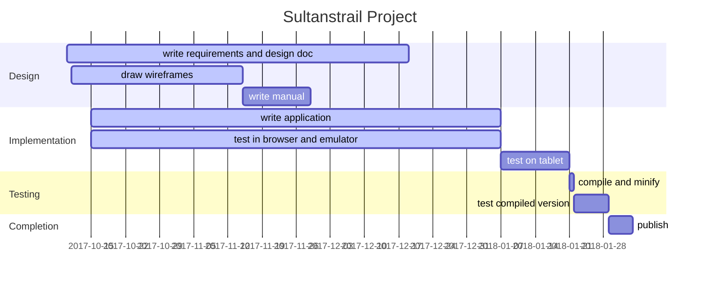

[toc]

# Design, Planning and Progress Document

## Purpose
Purpose of this document is to show what is to be created whithout being too restrictive at the start what the outcome should be. Furthermore, it shows what is planned and what steps are made to come to the end product.

Communication will be done by sending this document to the contacts after which there will be some comments, additions, changes or removals. This will be visible later in this document in the design and planning.

# Design
## Wireframes
### Purpose
Purpose of wireframes is that it will be visible how the application will look like. There are good programs for this but in this document I will only use the pictures from a designing program and make notes with it.

### Start page

  * [x] Map displayed, move around with swipe
    * [ ] Start with overview of whole route
    * [ ] Show sultans trail track
    * [ ] Show standard features for starting scale of map
  * [x] Zoom buttons
    * [x] zooming with buttons
    * [x] zooming by pinching (on mobile device)
    * [ ] Reveal more features when zooming in
    * [ ] Remove features when zooming out
  * [x]  North arrow button, click action aligns map to the north
  * [x] OSM attribution
  * [ ]  Responsive button, open pane on the side with some choices

### Pressing Responsive button
Pressing the responsive button will open a pane from the side to show a menu of options.

  * [ ] Exit, close the application
  * [ ] About, show a page with version, people and contacts

## Items or problems to think about
  * Color mapping must match that of the maps printed on paper.
  * Add ability to choose other color maps for visual impaired or color blind people.
  * By what license should the project be protected
  * When clicking on a feature on the map, does the information show in a ballon or on a new page
  * Feature information
    * Restaurant - reservation possibility
    * Hotel etc - booking possibility
    * Mosque - historic background
    * City, village - historic background, city elders contact info, etc

## Planning

# Contacts from Sultanstrail

|Name|Email|Notes|
|----|-----|-----|
| Sedat Cakir | sufitrail@gmail.com | Project leader
| Iris Bezuijen | sufitrail@gmail.com | Web Master
| Rob Polko | rob@sultanstrail.nl | Map Design
| Tine Lambers | | Office Manager
| Pijke Wees | | Cartograaf
| Marcel Timmerman | mt1957@gmail.com | Application Builder
