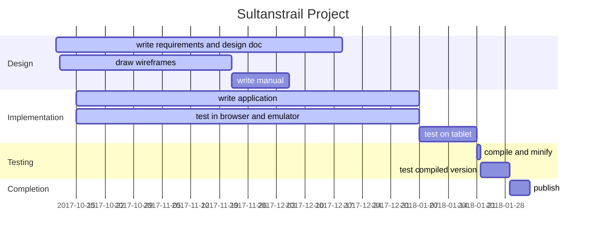

<!--
[toc]
-->
# Design, Planning and Progress Document

## Purpose
Purpose of this document is to show what is to be created without being too restrictive at the start what the outcome should be. Furthermore, it shows what is planned and what steps are made to come to the end product.

Communication will be done by sending this document to the contacts after which there will be some comments, additions, changes or removals. This will be visible later in this document in the design and planning.

# Design
## Wire frames
### Purpose
Purpose of wire frames is that it will be visible how the application will look. There are good programs for this but in this document I will only use the pictures from a designing program and make notes with it.

### Start page

  * [x] Map displayed, move around with swipe.
    * [x] Map should fill page automatically as well as the other pages.
    * [x] Show sultans trail track.
    * [x] Focus on track. Re-scale map after showing track for a more or less exact fit.
    * [ ] Map, Menu and buttons must be adjusted when device is rotated.
    * [ ] Show current location using GPS.
    * [ ] Show dashed line from current location to closest point on the trail when off trail (further than, lets say, 1 kilometer).
    * [ ] Show features for starting scale of map.
  * [x] Zoom buttons
    * [x] zooming with buttons.
    * [x] zooming by pinching (on mobile device).
    * [ ] Reveal more features when zooming in.
    * [ ] Remove features when zooming out.
  * [x]  North arrow button, click action aligns map to the north.
  * [x] OSM attribution.
  * [x]  Open menu on the right side with some choices.

### Pressing Menu button
Pressing the responsive button will open a pane from the side to show a menu of options.

 Show menu

  * [x] **Map**: show map and remove menu when clicked
  * [ ] **Info**: show route info
  * [ ] **Tracks**: Select a track. Show map again when a selection is made. The route is centered and fitted.
  * [ ] **Feature** show all of the history, or other info. Is filled when feature is clicked. First a balloon is showed on the map pointing to the feature with text and a 'more ...' on the bottom.
  * [ ] **Start**: record your track data
  * [ ] **About**: show a page with version, people and contacts
  * [ ] **Exit**: close the application

## Items or problems to think about
  * [ ] Color mapping must match that of the maps printed on paper.
  * [ ] Add ability to choose other color maps for visual impaired or color blind people.
  * [ ] By what license should the project be protected
  * [ ] When clicking on a feature on the map, does the information show in a balloon or on a new page. Feature information;
    * [ ] Restaurant - reservation information and facility
    * [ ] Hotel etc - booking information and facility
    * [ ] Mosque - historic background
    * [ ] City, village - historic background, city elders contact info, etc.
  * When online
    * [ ] When confirmed, refresh maps in cache
    * [ ] Try to get weather forecast and cache this information too

## Track data
The app uses gpx data to read track information, show it and focus on it when first loaded. These gpx files must be edited (by a separate program) to add some data in the metadata section and extensions section of the gpx file.
* [x] Program to make the calculations and store in gpx file: `gpx-edit.pl6`.
  * [x] Calculate minimum and maximum of longitude and latitude so the app doesn't have to do it.
  * [x] Calculate the center of the track for the same reason.
  * [x] metadata
    * [x] name; filename without '.gpx' and punctuation replaced by spaces.
    * [x] desc; "hiking routes from Vienna to Istanbul".
    * [x] author; "Sultanstrail".
    * [x] copyright; "Sultanstrail".
    * [x] link; "http://www.sultanstrail.com/".
    * [x] time; date and time of conversion.
    * [x] keywords; "hike", "Vienna", "Istanbul" and some others taken from the filename.
    * [ ] bounds; not used
    * [ ] extensions; not used

* [x] Remove all spaces between elements thereby making the gpx file smaller.
* [x] Program to convert all tracks using above program: `convert-all-tracks.pl6`.
  * [x] Convert tracks one by one.
  * [ ] Compress the track to a smaller format to make the payload smaller.
* [ ] Start showing the sultanstrail icon and only show content when everything is ready in the background. This provides a better user experience.

## Javascript
* [ ] In the process of making the javascript library payload smaller it is possible to change several calls to the google library into plain available calls
  * [x] Replace `goog.events.Listener` by standard `addEventListener` and `dispatchEvent` with `MouseEvent`.
  * [x] `goog.dom` by standard `querySelect()`, `querySelectAll()` and `document.createElement`
  * [ ] goog.ui.TabPane
  * [x] Replace `goog.style` with standard `style` on DOM elements
  * [ ] goog.fx
  * [ ] goog.fx.dom
  * [x] Replace `goog.dom.ViewportSizeMonitor` by standard `window.innerWidth` and `window.innerHeight`.

## Events to listen to
There are several events which can happen upon changing conditions in a device. These must be captured for further actions. No events are described wgich are caused by pressing a button or something like that.
* [ ] Battery conditions:
  * Warn user of battery low state. Can dim display or other options to save energy.
* [ ] Gps information.
  * Show current location
  * Record track of user
* [ ] Network on and off line mode. When on then
  * It is possible to update maps
  * Send out walked tracks
* [ ] Device orientation.
  * To show map correctly pointing the map-north to the real north.
* [ ] Camera.
  * To add the picture as a point on the map when saved.
* [ ] Time and clock.
  * Show date and time.

## Operating system dependencies
* [ ] Android: App, version?
* [ ] IOS: App, version?
* [ ] Windows: App, version?
* [ ] Linux: App and browsers Firefox, Opera?, Chrome?

## Bugs
* [ ] Hangup after a while when swiping etc. over the map
* [ ] Gpx file are missing a proper xml prefix after conversion

## Planning

# Contacts from Sultanstrail

|Name|Email|Notes|
|----|-----|-----|
| Sedat Çakir | sufitrail@gmail.com | Project leader
| Iris Bezuijen | sufitrail@gmail.com | Web master
| Rob Polko | rob@sultanstrail.nl | Map design
| Tine Lambers | | Office Manager
| Merel van Essen | | Writer of handbook
| Pijke Wees | pijkev@hotmail.com | Cartographer
| Marcel Timmerman | mt1957@gmail.com | Application builder
